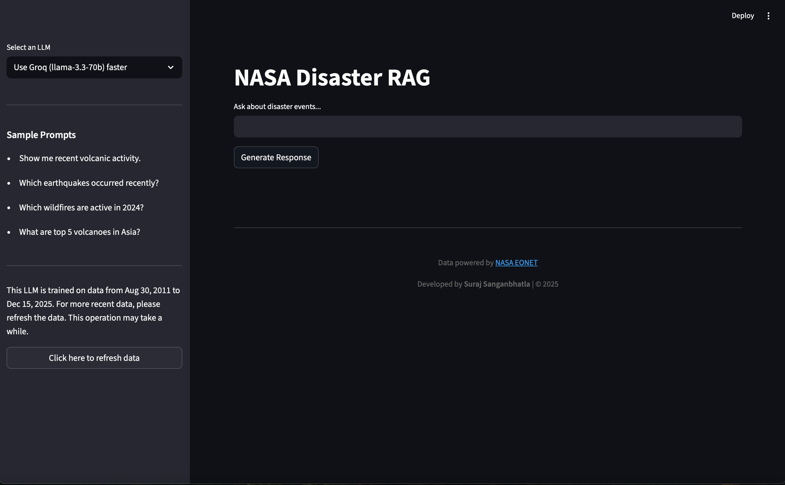
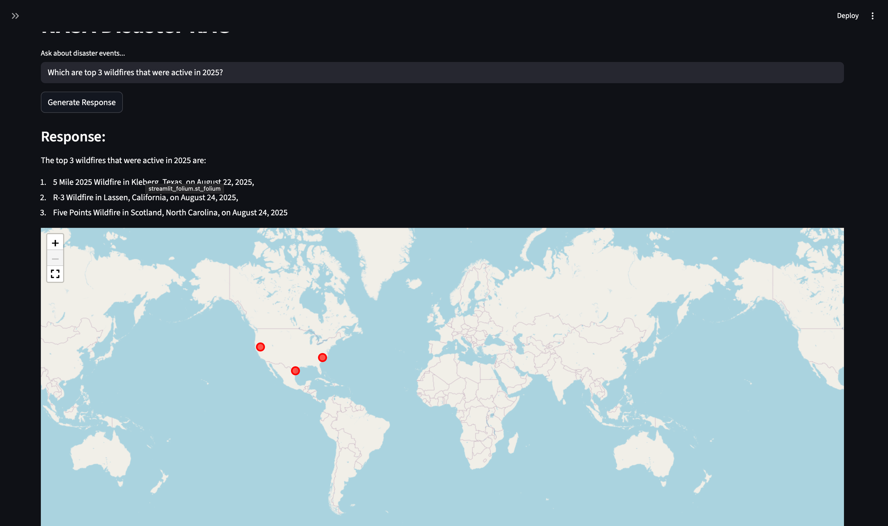

Alright, there's too much of AI generated content everywhere, so I wanted to write this myself. I definitely took help from AI in finishing this project for some simple repetitive tasks. But the code, idea, planning, structuring and mistakes are mine. 


## A bit of background
We all know LLMs are being used everywhere. I wanted to make use of them too, and wanted to learn about Retrieval Augmented Generation (RAG). This project is a RAG application built on NASA's data containing details about disaster events from the past across the world. 

## So what is this project? 

To put it in simple terms, you can ask about any disaster events that may have occurred across the world in simple plain English and the LLM gives you a response for those events. For example, you may ask "List the top 10 recent volcanoes in Asia" and the LLM will list them out and you'll see the exact locations on the world map.


## How does this work?

This custom RAG which I call as "NASA Disaster RAG" has the capability to answer questions on data from Mar 2011 to Dec 2025 at the time of writing this README file. In future, if you want the app to answer questions about more recent data, you can simply just click on "refresh data" and the app will fetch all data from NASA's database and updates the local (vector) database. 


## Two LLMs

To the top left, you'll see 2 LLMs. The first one, which is selected by default if "llama-3.3-70b" which comes from Groq API. The second one is "qwen2.5:0.5b" which comes from Ollama. To use the first one, you'll need an API KEY from Groq. You can use the second one by downloading Ollama in your local system.


## UI



## Technical details and using the app
If you're reading this section, you must've already known what API keys are, how to download Ollama (it's very simple, just a quick Google search) and how to create a .env file in your local system. So, once you download the repository, create a .env file and add all env variables. To keep things simple, I'll be pushing app.config file that has no secrets (did you expect that I'm a vibe coder? I'm not!) but has some file paths and URLs.

Once your env setup is done and all requirements are installed, just run 
``` python 
streamlit run app.py 
```
and see the magic!


# Thanks
Also if something breaks, it's probably a bug. So, I'd love your contribution and feedback!